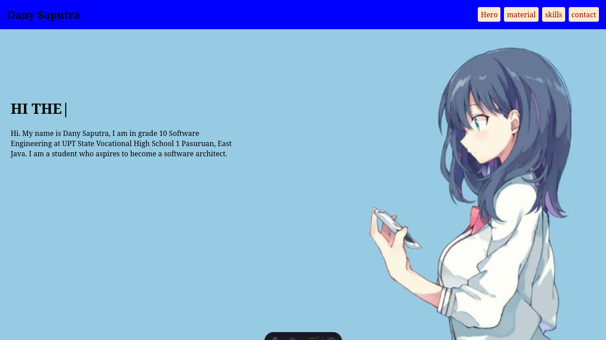

# First Assignment — Digital Profile Page

A personal digital profile page displaying a name, short bio, and skill list.  
Built as the first assignment for the Web Programming course, using a modern approach with **Astro** (going beyond the basic HTML5 + CSS3 requirement).

## Identity
- **Name:** Dany Saputra
- **Student Number / Attendance No.:** 11
- **Class:** X RPL 1
- **Subject:** Web Programming
- **Teacher:** Bagus

## Features
- [x] Hero section with name and tagline (typewriter effect)
- [x] "About Me" section
- [x] List of skills currently being learned
- [x] Contact card (GitHub & Instagram)
- [x] Navigation bar between sections
- [x] Parallax background effect
- [x] Dark mode design with blue accent

## Rubric Compliance

| No | Component | Weight | Status | Evidence / Notes |
|----|-----------|--------|--------|------------------|
| 1 | Project Completion | 30% | ✅ | Page successfully built and displayed in browser |
| 2 | HTML Implementation | 20% | ✅ | `<h1>`, `<h2>`, `<p>`, `<ul>/<li>` in `src/pages/index.astro` |
| 3 | CSS Implementation | 20% | ✅ | `background-color`, `color`, `font-family`, `padding` in `Layout.astro` |
| 4 | Creativity & Personalization | 20% | ✅ | Custom colors, content, and animations — not a template |
| 5 | Participation & Demo | 10% | ✅ | Demonstrated in class |

**Note:** The original assignment requires plain HTML + CSS on CodePen. This project was built with **Astro** as a self-directed exploration — all rubric criteria are still met (HTML structure, CSS styling, personalization).

## Tech Stack
- **Framework:** [Astro](https://astro.build) 5.x — static site generator
- **Languages:** HTML5, TypeScript (Astro default), JavaScript
- **Styling:** Plain CSS (scoped inside Astro components)
- **Additional libraries:**
  - `typed.js` — typewriter effect in the hero section
  - `rellax` — parallax background effect
- **Package Manager:** [Bun](https://bun.sh)

- **Deploy**: Github Action, [Github Pages](https://danydevid.github.io/grade10-industrial-task-1/)
## Getting Started

**Prerequisite:** [Bun](https://bun.sh) must be installed.

```bash
# 1. Clone the repository
git clone <your-repo-url>
cd portfolio

# 2. Install dependencies
bun install

# 3. Start the development server
bun dev
```

Open `http://localhost:4321` in your browser.

### Build for Production
```bash
bun run build     # outputs to the dist/ folder
bun run preview   # preview the production build
```

## Project Structure

```
.
├── astro.config.mjs      # Astro configuration
├── bun.lock              # Bun lockfile
├── package.json          # Project metadata & dependencies
├── tsconfig.json         # TypeScript configuration
├── public/               # Static assets (served as-is)
│   ├── astro-icon.svg
│   ├── contact-bg.jpg
│   ├── hero-background.jpg
│   ├── material.png
│   ├── skills-bg.png
│   ├── screenshoot.png
│   └── contactIco/       # Contact icons
│       ├── github.png
│       └── instagram.svg
├── src/
│   ├── assets/           # Assets optimized by Astro
│   │   └── astro-icon-light-gradient.png
│   ├── components/       # Reusable UI components
│   │   ├── Navbar.astro
│   │   ├── Typewriter.astro
│   │   └── contactCard.astro
│   ├── layouts/
│   │   └── Layout.astro  # Layout + global styling
│   └── pages/
│       └── index.astro   # Main page (automatic routing)
└── dist/                 # Build output (generated, not committed)
```

## Screenshot


## Notes
- **What I learned today:** HTML and CSS alone are enough to build a first web page — and I now understand how Astro generates HTML from components.
- **Challenges:** Initially confused about the difference between `public/` and `src/assets/` in Astro — eventually understood that `public/` is for files that don't need processing.
- **Next steps:** Learn responsive design (Flexbox) next week and add a dark/light mode toggle.
